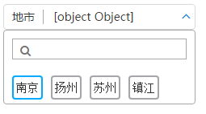

<rdk_title>第3步 完成查询条件栏 - RDK应用开发最佳实践</rdk_title>

## 目标与收获

本小节将完成 `my_first_app` 的条件查询栏剩余部分，通过本小结的学习，你将了解到

- ComboSelect控件
- BasicSelector控件
- Button控件

## 修改

BA告诉我们，这个功能的查询条件除了时间段以外，还有一个地市选择框。当然我们还需要有一个查询按钮可以触发一次查询。

### 增加地市选择框和查询按钮

一般的，我们把时段框，地市框，查询按钮这3个控件放在一行上，因此我们需要将这3个东西放在一个div里头。

编辑 `app/my_first_app/web/index.html` 文件，把body节点修改为：

~~~
<body ng-controller='RootController' class="rdk-loading">
    

		<rdk_time range setting="timeSetting"></rdk_time>
        <rdk_combo_select caption="'地市'">
            <rdk_basic_selector data="citys" multiple_select="true" label_field="name" track_item_by="id" editable="false">
            </rdk_basic_selector>
        </rdk_combo_select>
        <rdk_button label="查询"></rdk_button>
	

</body>
~~~
页面其他部分保持不变。我们碰到三个新的控件，分别是 [`ComboSelect`](/doc/client/controls/comboselect/rdk_comboselect.md) 、[`BasicSelector`](/doc/client/controls/basicselector/rdk_basic_selector.md)和[`Button`](/doc/client/controls/button/rdk_button.md)，在页面上引用之后，还需要注入对他们的依赖才能生效，[参考这里](03_use_first_control.md#dep-inject)。

编辑 `app/my_first_app/web/scripts/main.js`，增加[`ComboSelect`](/doc/client/controls/comboselect/rdk_comboselect.md)、[`BasicSelector`](/doc/client/controls/basicselector/rdk_basic_selector.md)和[`Button`](/doc/client/controls/button/rdk_button.md)这三个控件的依赖，具体操作方法和上一步类似，修改后的代码为：

~~~
var downloadDependency = [
        // 所有路径中的 base 都会被替换成本页面html文件所在路径
        // 注意：所有的url都不能加 .js 扩展名
        

        // 带有 alias 属性的条目，可以通过 ctx.alias 的方式来访问到
        { url: 'base/scripts/utils', alias: 'utils' },
        { url: 'base/scripts/i18n',  alias: 'i18n'  },

        // css类型的文件需要加 css! 的前缀，注意url上不能加 .css 扩展名
        'css!base/css/style',

        // 这类 rd. 开头的条目是RDK预定义好的控件url别名
        'rd.controls.Time','rd.controls.ComboSelect', 'rd.controls.BasicSelector','rd.controls.Button'
    ];
~~~

然后，给地市选择框提供备选项：

	scope.citys = [
		{id: 1, name: '南京'},
		{id: 2, name: '扬州'},
		{id: 3, name: '苏州'},
		{id: 4, name: '镇江'},
	]

> 注意 
> 一般来说，地市的备选项是需要从服务端查询得到的，这里为了调试界面能够正常显示，直接写死，这个问题留在后续步骤解决。

### 地市显示异常
此时刷新页面后，选中任意一个地市，地市框显示异常：

这是[`ComboSelect`](/doc/client/controls/comboselect/rdk_comboselect.md)控件不识别我们地市的数据结构导致的，需要增加一个属性告诉[`ComboSelect`](/doc/client/controls/comboselect/rdk_comboselect.md)控件如何识别一个地市。

修改页面代码，找到 `rdk_combo_select` 节点，添加一个新的属性，代码为：

	child_change="selected2string"

`child_change` 的值是一个 名为 `selected2string` 的函数，我们需要将它定义在scope对象上。编辑js脚本，添加上 `selected2string` 的定义，代码为：

	scope.selected2string = function(selected, context, index) {
		var selectedCitys = '';
		angular.forEach(selected, function(city) {
			selectedCitys += city.name + ' ';
		});
		return selectedCitys;
	}

> 扩展： 
> angular.forEach是angular提供的一个遍历函数，很有用，[访问这里](http://docs.ngnice.com/api/ng/function/angular.forEach)可以了解更多。站点 <http://docs.ngnice.com/api> 提供了AngularJS所有文档，建议仔细阅读。

### 样式调整

三个控件并未对齐，分别在地区控件和查询按钮控件上增加样式：`style="vertical-align:bottom"`

给时间控件和ComboSelect控件增加样式： `margin-right:30px`

### 效果预览

保存后刷新浏览器，我们就得到一个简单的查询条件栏了，此时页面看起应该是这样的：

## 小结
我们完成了查询条件栏的剩余部分，碰到了三个新的RDK控件：[`ComboSelect`](/doc/client/controls/comboselect/rdk_comboselect.md)、[`BasicSelector`](/doc/client/controls/basicselector/rdk_basic_selector.md)和[`Button`](/doc/client/controls/button/rdk_button.md)

## 跳转
[上一步](03_use_first_control.md)、[下一步](05_first_service.md)

## 源码
[04_finish_condition_bar.zip](04_finish_condition_bar.zip) 下载后解压到 `rdk/app/my_first_app` 目录下即可。