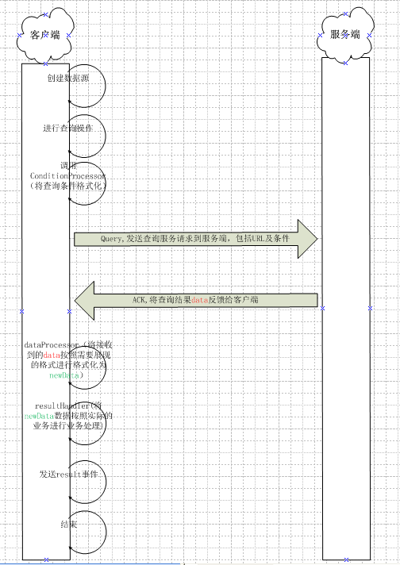

# 数据源 #
数据源是RDK中的一个重要概念，它是RDK前后端交互的纽带。

- 它可以请求标准REST服务、非标准REST服务，也可以请求服务器上的静态资源。
- 可以自动将请求的结果与UI或者控件绑定，应用无需编写一行代码就可以将后端服务结果呈现在界面上。
- 支持GET/PUT/POST/DELETE 4个HTTP动作分别对应着查询/新增/修改/删除4个动作。
- 支持发起周期性请求。

## 创建数据源 ##
### 在DOM上直接创建数据源 推荐 ###

方式1 **推荐**，集成到任意dom节点上。这个方式代码高度内聚，强烈推荐尽量使用这个方式，后续维护起来很方便。

	<-- 方式1 推荐，集成到任意dom节点上 -->
	<ANY ds="ds_user" ds_url="demo/user_list" ds_query_if="ready"></ANY> 

方式2，使用ds节点。这个方式会污染dom树，不推荐。方式2主要是作为方式1的补充。在一个dom节点上只能用方式1创建一个数据源，如果一个节点需要多个数据源则可以使用方式2来创建数据源，或者使用js创建数据源。

	<-- 方式2，使用ds节点 -->
	<ds id="ds_user" url="demo/user_list" query_if="ready"></ds>

### 在JS代码中创建数据源 ###
注意：在js中创建出来的数据源**必须赋予scope属性**才能实现双向绑定：

	var ds = DataSourceService.create({
	    id: 'dsId', //必选，数据源id
	    url: '/demo/my_url', //必选，数据源url
	    resultHandler: function() {}, //可选，结果处理函数，常用属性
	    conditionProcessor: function() {}, //可选，查询条件处理器
	    dataProcessor: function() {},      //可选，数据处理器
	    queryMethod: 'get',     //可选，查询时使用的http动词
	    addMethod: 'put',       //可选，新增时使用的http动词
	    updateMethod: 'post',   //可选，更新时使用的http动词
	    deleteMethod: 'delete', //可选，删除时使用的http动词
	    queryIf: '',    //可选，触发查询的条件
	    addIf: '',      //可选，触发添加的条件
	    updateIf: '',   //可选，触发修改的条件
	    deleteIf: '',   //可选，触发删除的条件
	});
	//在js中创建出来的数据源必须赋予scope属性才能实现双向绑定
	ds.scope = $scope;

注意上面代码使用到了 `DataSourceService` 服务，需要将这个服务的依赖注入到应用的控制器中。关于依赖注入，[请访问这里](../dependency_injection.html)。

## 数据源的使用 ##
我们可以像使用本地数据一样方便的使用网络上的资源，请看下面例子
<live_demo example="common/datasource/with_select/" width="500" height="40"></live_demo>

### 属性说明 ###

#### `ds_id` / `id`
数据源id，访问数据源的标示符，如果使用DOM方式创建数据源，则会在当前 `scope` 上创建一个与数据源id相同的属性，它的值是数据源调用服务的结果或者 `ds_init_data` 属性对应的对象。

#### `ds_url` / `url`
数据源对应的服务url。

#### `ds_result_handler` / `resultHandler`
`scope` 上的一个函数，作为数据源结果处理器，数据源访问网络得到结果之后，会调用此属性对应的函数。
#### `ds_init_data` / `initData`
数据源的初始化数据json字符串表达式，RDK会将这个json字符串转为一个json对象。数据源从开始访问网络到获得应答之间有时差，为了页面上有更好的用户体验，可以设置这个值作为数据源得到真正数据之前的提示值，可以防止页面抖动。

#### `ds_condition_processor` / `conditionProcessor`
`scope` 上的一个函数，作为数据源条件处理器，该函数必须返回一个对象作为本次访问网络的条件，在数据源访问网路之前会调用此函数。一般用于对查询条件做细微调整。

#### `ds_data_processor` / `dataProcessor`
`scope` 上的一个函数，作为数据源结果处理器，该函数必须返回一个对象作为本次访问网络的结果，在数据源访问网路得到数据之后会调用此函数。一般用于对服务的原始结果做细微调整。

#### `ds_query_method` / `queryMethod`
字符串，取 get/put/post/delete 这4个值中的一个作为数据源**查询请求**的 HTTP 动词，默认值是get。标准rest服务查询的 HTTP 动词是get。

#### `ds_update_method` / `updateMethod`
字符串，取 get/put/post/delete 这4个值中的一个作为数据源**更新请求**的 HTTP 动词，默认值是post。标准rest服务更新的 HTTP 动词是post。

#### `ds_add_method` / `addMethod`
字符串，取 get/put/post/delete 这4个值中的一个作为数据源**添加请求**的 HTTP 动词，默认值是put。标准rest服务添加的 HTTP 动词是put。

#### `ds_delete_method` / `deleteMethod`
字符串，取 get/put/post/delete 这4个值中的一个作为数据源**删除请求**的 HTTP 动词，默认值是delete。标准rest服务删除的 HTTP 动词是delete。

- `ds_query_if` / `queryIf`：一个RDK表达式，用于描述数据触发查询的时机。
- `ds_update_if` / `updateIf`：一个RDK表达式，用于描述数据触发更新的时机。
- `ds_add_if` / `addIf`：一个RDK表达式，用于描述数据触发添加的时机。
- `ds_delete_if` / `deleteIf`：一个RDK表达式，用于描述数据触发删除的时机。

### 获得数据源的数据 ###
一般来说，我们无需直接去读取数据源从网络上获取到的数据，RDK的所有控件，双向绑定机制等都已经足够智能去自动取得这些数据了。尽管如此，`数据源`还是提供了多种途径允许应用自行取得这些数据。

**方法1**：访问数据源实例的 `data` 属性

	// ... 让数据源访问网络，获得数据 ...
	var ds = DataSourceService.get('my_ds');
	var data = ds.data; // data即为数据源的数据了

**方法2**：访问 `scope` 上以数据源id为键的值

	var ds = DataSourceService.create('my_ds', 'my/data/url');
	//在js中创建的数据源必须显式赋予scope属性
	ds.scope = scope;
	// ... 让数据源访问网络，获得数据 ...
	var data = scope.my_ds; // data即为数据源的数据了

注意，在js中创建的数据源如果没有赋予`scope`属性，则此方法行不通。

### 控制数据源触发的时机 ###
在前面例子中有一个属性 `ds_query_if` 属性，用它可以控制数据发起查询的时机，下面的代码会让数据源在RDK初始化完成之后立即发起查询：

	ds_query_if="ready"

除此之外， `ds_query_if` 还支持更加复杂的表达式：

	ds_query_if="dispatcher.event_type"

其中，`dispatcher` 是某个事件发出者，可以是一个控件的id，也可以是一个数据源的id等；`event_type` 是一个事件类型。

还支持 `and` 运算，当表达式中的每个事件都发出至少一次之后，当前数据源才会发起查询：

	dispatcher1.event_type1 and dispatcher2.event_type2 and ...

请看一个实例：
<live_demo example="common/datasource/query_if_ready/" width="500" height="110"></live_demo>

数据源每个动作都有对应的 if 属性：

- `query_if`：查询控制
- `add_if`：添加控制
- `update_if`：更新控制
- `delete_if`：删除控制

### 为数据源添加数据处理器 ###
当服务端返回的数据结构和控件期望的数据结构有出入的时候，则可以通过 `ds_data_processor` 属性来实现数据转换，`ds_data_processor` 的值是 `scope` 上的函数名。
<live_demo example="common/datasource/data_processor/" width="400" height="90"></live_demo>

### 为数据源添加结果处理函数 ###
通过 `ds_result_handler` 属性可以给数据源添加结果处理函数，`ds_result_handler` 的值是 `scope` 上的函数名。当数据源有了结果（成功&失败），都会调用这个函数。这个功能在我们需要手工处理数据源的应答的时候非常有用。

	<!-- HTML代码 -->
	<any ds="ds_city" ds_url="/demo/mock_data/city_list"
	    ds_data_processor="toString"
	    ds_result_handler="showMessage">
	</any>

`ds_result_handler` 用起来和 `ds_data_processor` 很类似，容易混淆，下面是他们的不同之处

- `ds_data_processor` 是用来对数据源返回的数据进行二次加工的，而 `ds_result_handler` 是用来当做数据源的结果回调函数用的。
- `ds_data_processor` 需要返回一个数据当做数据源的结果，而 `ds_result_handler` 不需要返回任何结果
- `ds_data_processor` 先于 `ds_result_handler` 被执行

下面是例子，注意到数据源先执行了 `toString()` 把一个复杂结构的数据转成了字符串，然后才调用 `showMessage()` 将结果 alert 出来。
<live_demo example="common/datasource/result_handler/" width="400" height="40"></live_demo>

除了使用 `ds_result_handler` 添加结果回调的方式，还可以通过[事件](/demo/common/event)的方式。每个数据源访问网络有了结果（成功/失败），都会通过数据源id发出一个 `result` 事件，监听此事件可以处理改数据源的结果。与 `ds_result_handler` 的方式相比，事件方式更加灵活，可以在代码的不同位置给同一个数据源添加多个事件回调，这样对提高代码的内聚性有帮助。

	//下面代码执行的结果和 ds_result_handler 一样
	EventService.register('ds_city', 'result', function(event, data) {
	    scope.showMessage(data);
	});

### 为数据源添加条件处理器 ###
数据源查询往往是需要带一些查询条件到服务端的，有时候查询条件可能会比较复杂，或者需要做一些转换，或者为不同数据源的条件做一些相同的处理，此时我们会用到条件处理器。条件处理器的使用方法和结果处理器 `ds_data_processor` 非常类似：

	<!-- HTML代码 -->
    <any ds="ds_city" ds_url="/demo/mock_data/city_list"
        ds_condition_processor="conditionProcessor" ds_query_if="ready">
    </any>

	// JS代码
	scope.conditionProcessor = function(condition) {
	    //入参condition是触发数据源时应用提供的原始条件
	    return {con: '这是查询条件'};
	}
    或者
    scope.conditionProcessor = function(condition ，ds) {
	    //入参condition是触发数据源时应用提供的原始条件
        //入参ds是执行该条件处理器的数据源实例
	    return {con: '这是查询条件'};
	}

提示

1. 在使用 `ds_query_if` 自动发起查询时，`ds_condition_processor` 会非常有用。
2. 在使用数据源的周期性任务时，`ds_condition_processor` 会非常有用。
3. 数据源的各种处理器的调用顺序是 `ds_condition_processor` -> `ds_data_processor` -> `ds_result_handler`

### 手工触发数据源的查询 ###
尽管 `ds_query_if` 非常有用，但是有时候我们总是想要自己控制数据源发起查询的时机。下面这个例子演示了直接调用数据源实例的 `query()`/`add()`/`update()`/`delete()` 方法来触发数据源：

<live_demo example="common/datasource/result_handler/" width="400" height="40"></live_demo>

下面实例代码演示了通过事件的方式触发：

    scope.query = function() {
        //事件方式触发数据源
        var conditioin = {};
        EventService.broadcast('ds_city', 'start_query', conditioin);
    }

一共有4个事件：

- `start_query` 事件，对应数据源的 `query()`
- `start_add` 事件，对应数据源的 `add()`
- `start_update` 事件，对应数据源的 `update()`
- `start_delete` 事件，对应数据源的 `delete()`
- `start_loop` 事件，对应数据源的 `loop()`

### 周期性任务 ###
在某些场合，需要让数据源定时发起查询，使用 `loop()` 方法可以启动周期性任务。

	//下面的代码会让数据源每2秒钟发起一次查询
	//action属性备选：query/add/update/delete
	var ds = DataSourceService.get('myid');
	ds.loop({action: 'query', interval: 2000});
	
	//同样的，也可以通过事件来触发，效果和调用loop函数完全一致
	EventService.broadcast('myid', EventTypes.START_LOOP,
		{action: 'query', interval: 2000});

提示：周期性任务常常和 `ds_condition_processor` 配合使用。

在周期性任务完成之后，可以调用 `stopLoop()` 停止周期性任务。

	ds.stopLoop();

### url模板 ###
在数据源的目的服务不是标准RESTful服务的时候，需要用到这个功能，差别仅在于url，其他的参数没有区别。下面以一个基于Hibernate实现的服务的url
 /configureManage/overview/vipGroupUpdate.do?id=11&amp;module="overview"&amp;value=1111 
其中带有颜色的部分都是动态的，这个URL的作用是更新某些数据，但是它却是通过HTTP GET的方式发送的。

可以使用下面的url模板解决

	//注意url部分
	//%module%：读取条件中的module属性，注意到它被两个%包围
	//$confItem$：读取条件中的confItem属性，注意到它被两个$包围
	//差别是$包围的条件不会再在?后面（即query区）再次出现
	var ds = DataSourceService.create('myid', '/configureManage/%module%/$confItem$$action$.do');
	//强制让数据源使用get的方式更新数据
	ds.updateMethod = 'get';
	ds.update({
	   module: 'overview',
	   confItem: 'vipGroup',
	   action: 'Update',
	   id: 11,
	   value: 1111
	});

### 数据源查询流程 ###

以下为创建数据源并进行数据源查询的流程图，相关定义请参照本文档的`在JS代码中创建数据源`部分的内容。

