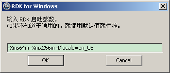

<rdk_title>RDK应用开发基础</rdk_title>

## 应用包结构

下面是一个应用的目录结构，所有应用都采用下面的结构保存文件

	my_app/                  --> 应用根目录
		web/                 --> 前端html和代码
			index.html
			css/
			scripts/
				main.js
				utils.js

		server/             --> 后端服务代码
			my_service.js
			other_service.js

		build/              --> 应用编译相关（可选）
			make_app.sh

## 搭建基于windows的开发环境 推荐 {#make-dev-env}

按照本小节介绍的方法，可以打造一个基于windows平台的RDK的web和rest服务的开发&调试环境！

将下面的svn地址check out到你本地：

	http://10.5.70.3/ZXVMAX/CODE/dev/ZXVMAX/vmax-app-comm/vmax-rdk/

假设你本地的目录是 `d:\vmax-rdk\rdk_server`，**注意你本地的目录最里面的文件夹必须是 `rdk_server`**，否则会导致HTTP服务运行不正常。

编辑 `d:\vmax-rdk\rdk_server\proc\conf\rdk.cfg`，修改数据ip即可：

	#连接的数据库ip，原本有可能是注释掉的，要删掉开头的#字符，并修改为实际值
	database.gbase.hostList=10.43.149.74

确定当前电脑已经安装了nodejs，如果没有烦请[下载nodejs](http://10.9.233.35:8080/tools/node-v5.10.1-x86.msi)并正确安装。最后，运行 `d:\vmax-rdk\start.exe` 就可以启动RDK的开发环境了。

先无视控制台报的异常信息,打开浏览器，输入 `http://localhost:8080/rdk/service/app/example/server/my_service` 看到浏览器显示如下文本，表示一切正常：

	{"result":"这是来自 app/example/server/my_service.js 服务的问候！"}

打开浏览器，输入 `http://localhost:8080/rdk_server/app/example/web/index.html`，页面能打开表示一切正常。

到此，你就把开发环境搭建完毕了。

### 配置ActiveMQ（可选）
如果你的应用使用到了 `mq` 的相关功能，则必须在启动之前，配置好ActiveMQ的相关信息：

	# ActiveMQ的IP，一般是vmax系统的应用层IP
	ActiveMQ.ip=localhost
	ActiveMQ.port = 61616

### 配置语言环境（可选）{#lang}
系统启动默认使用中文启动，如果你想修改为其他语言，则必须在启动RDK时，在参数中加入 `-Dlocale=en_US`

### 常见错误

#### 未找到运行环境
如果启动的时候，报错：

说明你的环境上没有java运行环境，或者没有按照对话框提示的位置存放Java运行环境。

#### 运行环境版本过低
如果启动的时候，报错：

说明你当前环境使用的Java运行环境版本过低，请使用至少Java1.8以上的版本。这里可以[下载](http://10.9.233.35:8080/tools/jre_win_1.8.zip)到Win32的Java8运行环境。

#### example页面长时间都是空白 {#can-not-open-example}

1. 检查一下本地的目录的最里面的文件夹是不是 `rdk_server`，如果不是，请改过来。

#### 'node' 不是内部或外部命令

控制台报错：

	'node' 不是内部或外部命令，也不是可运行的程序
	或批处理文件。
	请按任意键继续. . .

原因：说明当前电脑没有安装nodejs

解决：[下载nodejs](http://10.9.233.35:8080/tools/node-v5.10.1-x86.msi)并正确安装

#### 端口被占

	connect.limit() will be removed in connect 3.0
	events.js:141
	      throw er; // Unhandled 'error' event
	      ^
	
	Error: listen EADDRINUSE 0.0.0.0:8080
	    at Object.exports._errnoException (util.js:870:11)
	    at exports._exceptionWithHostPort (util.js:893:20)
	    at Server._listen2 (net.js:1237:14)
	    at listen (net.js:1273:10)
	    at Server.listen (net.js:1369:5)
	    at Object.<anonymous> (developing\demo\nodejs\serv\server.js:55:24)
	    at Module._compile (module.js:410:26)
	    at Object.Module._extensions..js (module.js:417:10)
	    at Module.load (module.js:344:32)
	    at Function.Module._load (module.js:301:12)

原因：8080端口被占用

解决方案：

编辑 `d:\vmax-rdk\tools\http_server\serv\config.json` 文件，修改其中的端口号就行啦：

	{
		"root": "./../../../",
		"port": 8080,
		"proxy": [{
			"url": "/rdk/service",
			"port": 5812,
			"host": "localhost"
		}]
	}

> **注意** 
> 1. 8080端口可以随意改为其他值 
> 2. 这些配置项能工作的前提是你已经按照[搭建基于windows的调试环境](#make-dev-env)小节的方法配置好本地Rest服务的运行环境了。否则请根据自身实际情况修改上述配置项。

## 开发第一个应用

新手宝典：[天龙八步](/rdk_server/doc/best_practise/index.md)，把一个应用拆分出若干个步骤讲解开发过程，隆重推荐。

## 开发前端部分

这部分请参考[rdk客户端部分的文档](/doc/client/index.html)。注意最好查看当前环境所使用的rdk客户端对应版本的文档。

## 开发后端部分

### 定义服务

后端采用js语言开发，下面是一个简单的后端服务例子的代码

	(function() {
	
	    return function(request, script) {
			//在这里写下你的第一行代码
			return "这是来自 " + script + " 服务的问候！"
	    }
	
	})();

给上面这段代码起个名字叫做 my_service.js，并将它保存到应用目录下的 server 目录下，这样我就定义好了一个叫 `my_service` 的服务了，并且它现在已经可以开始工作了。

### 给应用添加菜单
RDK应用的菜单配置信息在应用包内的 `web/menu/` 目录下，该目录下有两个文件，一般只需要修改 `menu_cfg.ini` 这个文件，它的内容如下：

	#归属的二级菜单
	menuKey='com_zte_com_SQM_Special'
	
	#三级菜单
	zhMenu3='呼叫分析'
	enMenu3='Call Analysis'

一共3个配置项：

- menuKey: 归属的二级菜单key，如果需要新建归属的二级菜单项，请阅读本小节的后续部分；
- zhMenu3: 配置本应用的菜单信息，就是需要显示在ICT菜单中的菜单项，对应中文描述；
- enMenu3: 同 `zhMenu3`，对应英文描述；

保存后，随应用的其他文件一起提交到svn即可，新的版本制作出来之后，会自动将菜单挂上。

如果需要测试一下是否有效，可以将 `web/menu/` 目录传到服务器上相应应用文件夹下，然后在shell终端中执行该文件夹下的 `merge_menu.sh` 脚本即可。脚本执行完毕之后，刷新一下浏览器就可以看到效果啦。

**如何添加二级菜单**

下载[`merge_lv2_menu.sh`脚本](/rdk_server/app/sqm/special_service/merge_lv2_menu.sh)，放在app目录下的任意子目录中，不要修改脚本文件名！

RDK推荐将应用按照菜单挂载的层次存放应用目录，因此**最好放在应用归属的二级菜单目录下**。比如“专题分析”这个二级菜单，出现在“业务质量”这个一级菜单下，因此将创建“专题分析”的脚本放在 `app/sqm/special_service` 目录下就非常合适。

编辑这个 `merge_lv2_menu.sh` 脚本：

	#!/bin/sh
	
	#二级菜单
	zhMenu2='专题分析'
	enMenu2='Special Analysis'
	menuKey='com_zte_com_SQM_Special'
	
	basepath=$(cd `dirname $0`; pwd)
	cd $basepath
	。。。。

修改 `zhMenu2`, `enMenu2`, `menuKey` 这3个属性：

- `zhMenu2` 和 `enMenu2` 是二级菜单的国际化
- `menuKey` 是二级菜单的key，可以随便起，不能和已有的菜单的key重复。

修改完提交svn即可。可以将这个脚本传到服务器上执行一下，看看是否生效。

### 调用服务

可以使用浏览器直接调试服务。在浏览器中敲入下面url就可以调用 `app/example/server/my_service` 服务了：
	
	http://10.43.149.193:26180/rdk/service/app/example/server/my_service

如果需要给服务传递参数，可以使用下面的url

	http://10.43.149.193:26180/rdk/service/app/example/server/my_service?p=%7Bparam:%7Bkey:%20%22value%22%7D%7D

注意到多了一个 ?p=xxxx 的部分，这个部分中的数据可以由RDK携带给对应的服务，它被url编码过了，解码后，它的内容为：

	?p={param: {key: "value"}}

是一个非常简单的json字符串。`app/example/server/my_service` 服务收到的参数为：

	{key: "value"}

注：

- 参数部分**必须使用url编码**，在RDK客户端会自动进行url编码，但是手工调服务必须自己编码
- [这个网页](http://tool.oschina.net/encode?type=4)提供了一个好用的在线url编解码转换工具

	
服务的应答数据会以字符串的形式直接呈现在浏览器上，注意，此时看到的应答的数据结构为原始数据结构，在实际开发中，RDK会自动将这些字符串转为json对象的。

使用这个方式只能调试服务的GET请求，如果要调试其他的请求，需要下载专门的rest调试工具，比如[这个工具](http://code.fosshub.com/WizToolsorg-RESTClient/downloads)就挺好用。

### 调试服务
日志是调试服务的常用手段，简单又方便。

RDK提供了一组记录日志的函数，它们有共同的定义：
	
	function log(msg1, msg2, msg3, ...)；

参数：

- `msg1`, `msg2`, ... 任意对象。可选。RDK会尝试将这些对象转为字符串写入日志中，目前完美支持Date，任意结构的json对象。对其他复杂对象支持不好，不支持Java对象。

一共有这些（日志级别由低到高）：

- `log()` / `debug()`：记录debug级别的日志
- `info()`：记录info级别的日志
- `warn()`：记录warn级别的日志
- `error()`：记录error级别的日志
- `fatal()`：记录fatal级别的日志
- `crit()`：记录一些关键日志，级别最高

日志生成在app目录下的 server/logs/log.txt 文件内。

### 调试服务 进阶篇

本小节介绍如何**在实现服务的js文件中设置断点debug**！

为了能够设置断点，我们需要在本地搭建一个后端服务的运行环境，听起来好像很复杂，实际上，的确有些麻烦。

[点击这里继续](how_to_debug_service.md)

### Web页面中使用服务

下面看看如何调用这个服务。

在前端定义一个数据源，将url指向这个服务：

	<!-- 这里演示了如何调用后端服务，应用需要根据自身所在路径修改服务路径 -->
	

	

上面这段代码会调用后端的 `my_service` 服务，并将它的值通过 `p` 标签显示在网页上。有几个地方需要关注：

- ds 属性。它定义了一个名为 `msgFromSvr` 数据源。
- ds_url 属性。它的值就是前面我们定的 `my_service` 服务的url。
- ds&#x5f;query&#x5f;if 属性。它在网页加载完毕之后立即调用 `my_service` 服务。关于这3个属性的更多信息，请参考前端的开发手册。
- ng-bind 属性。使用双向绑定将从后端查询得到的数据作为 `p` 标签的内容。

### 处理请求参数

前端调用服务的时候，可以传递任意结构的数据到后端，后端可以通过 `request` 来应用这些参数：

	(function() {
	
	    return function(request, script) {
			//直接将前端传递过来的参数打印到日志中。
			log(request);
	    }
	
	})();

此外，RDK框架还会把当前脚本的url传递进来，通过 `script` 变量可以应用到。

### 返回服务数据

服务将需要返回的数据组装成一个json对象，通过js的关键字 `return` 返回即可：

	var result = ...
	return result;

注意，`result` 必须是一个json对象。java对象是无法序列号为json字符串的，因此java对象无法直接返回。`sql()` 函数返回的值就是一个java对象，因此 `sql()` 函数的返回无法直接返回给前端。

### 处理其他HTTP动词

下面代码只能处理HTTP GET请求：

	(function() {
	
	    return function(request, script) {
			//在这里写下你的第一行代码
			return "这是来自 " + script + " 服务的问候！"
	    }
	
	})();

对于其他的HTTP动词，可以这样写：

	(function() {
	
		function _get(request, script) {
			return 'http get result!';
		}
		function _put(request, script) {
			return 'http put result!';
		}
		function _post(request, script) {
			return 'http post result!';
		}
		function _delete(request, script) {
			return 'http delete result!';
		}

	    return {
			//注意大小写敏感
			get: _get,
			put: _put,
			post: _post,
			delete: _delete
	    }
	
	})();

即返回的值如果是一个函数，则认为是HTTP GET请求的处理函数，如果返回的是一个对象，则取出其中对应HTTP动词对应的属性作为其处理函数。

## 在 Linux 上运行多个RDK服务 ###

到任意一个能够正常使用rdk服务的环境，将该环境上的rdk进程文件拷贝一份到任意目录下。你也可以将进程拷贝到其他未安装rdk服务的任意服务器上，效果一样。本文以相同服务器为例。

现假设在该服务器上的如下目录再部署一个rdk服务：

	/home/my_rdk_server

只需要运行如下的shell命令

	cd /home/netnumen/ems/ums-server/procs/ppus/rdk_server.ppu/rdk_server-webapp.pmu/rdk_server.ear/rdk_server.war/
	mkdir -p /home/my_rdk_server/
	cp -fr * /home/my_rdk_server/

编辑 `/home/my_rdk_server/proc/conf/rdk.cfg`，将文件中的如下3行按实际修改：

	#这个要改为本机ip，不能使用localhost
	listen.ip   = 10.43.149.193

	#端口改为其他任意值，只要不和现有端口冲突即可
	#如果端口冲突，则启动rdk服务的时候会报错
	#这个端口本文后续部分会用到，请记住它
	listen.port = 12121

	#连接的数据库ip，原本有可能是注释掉的，要删掉开头的#字符，并修改为实际值
	database.gbase.hostList=10.43.149.74

记得保存。随后就可以启动这个目录下的rdk服务了，使用下面的shell命令

	cd /home/my_rdk_server/proc/bin
	chmod +x *.sh
	./run.sh
	#在本目录下执行./shutdown.sh可以只杀死本目录下的rdk服务
	#而不影响其他目录下的rdk服务

看到类似下面的打印表示启动正常

	#注意不能是127.0.0.1，而必须是一个有效ip
	Bound to localhost/10.43.149.193:12121

在浏览器中输入下面url：

	http://10.43.149.193:12121/rdk/service/app/example/server/my_service

看到下面的输出表示一切正常：

	{"result":"这是来自 app/example/server/my_service.js 服务的问候！"}

**常见错误1**：端口冲突

	Bind to localhost/127.0.0.1:5812 failed

**常见错误2**：数据库ip地址没改

	2016-05-20 13:59:25,573 WARN [Config@Global] - load '../../../../../../utils/vmax-conf/serviceaddress.conf' error: 
	java.io.FileNotFoundException: ../../../../../../utils/vmax-conf/serviceaddress.conf (No such file or directory)
	...

