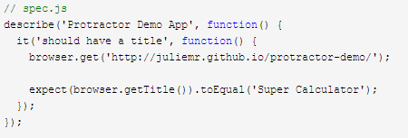
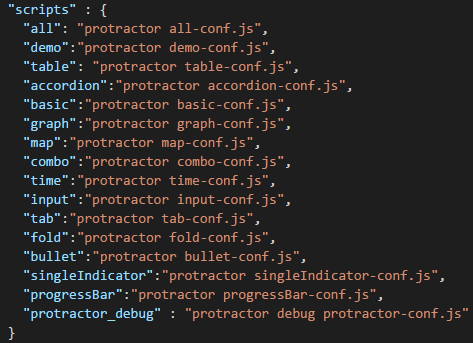
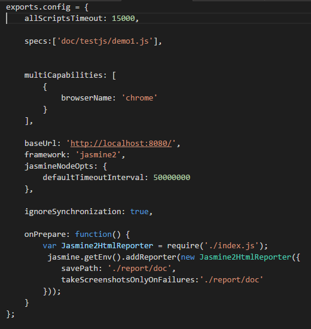

#Protractor使用  
##一.简介  
1.Protractor是一个建立在WebDriverJS基础上的端到端(E2E)的AngularJS JavaScript Web应用程序测试框架。Protractor全自动化真实的模拟用户在真正的浏览器中操作、运行并测试开发者的应用程序。  
官方地址：[http://www.protractortest.org/](http://www.protractortest.org/)  
Github地址:[https:github.com/angular/protractor](https:github.com/angular/protractor)  
2.使用需要具备的环境和使用者基础知识  
  
如图所示使用protractor需要本地环境具备配置好的node、npm，版本最好是4.x以上；  
简单的node操作和了解npm 命令、依赖包概念；  
浏览器选用默认安装路径，否则报错“can not find chrome binary”，版本一般使用当前版本前几个版本，目前chrome 50.0xxx支持性能比较好，firefox 40.0；  
Selenium自动化测试工具(api)；
Webdriver (api)，webdriver其实是selenium 2.0和原webdriver的结合，他们与jasmine的关系具体参考: [http://sentsin.com/web/658.html](http://sentsin.com/web/658.html);  
前端选择器的选取；  
前端常见样式的理解；  
##二.编写规范  
官方示范：  
  
多场景：  
  
优点：多场景下执行每个场景单元测试均会重新打开测试页面，让数据恢复、dom恢复，以确保测试结果的准确性。  
缺点：当测试的场景足够多、页面结构复杂、数据量大的时候，每次页面刷新到稳定停留的时间比较长的弊端明显暴露出来，并且复杂页面每次点开都会有获取失败的风险。  
优化：在同一个测试页面中，只让页面打开一次，场景尽量保持相对独立不影响，也就是说即使第一个测试单元出错不会影响第二个测试结果的准确性。  
##三.如何进行测试  
以rdk内test/doc/testDemo下html为例  
打开cmd终端到test 目录下，输入npm run demo就可以观察运行和浏览器的变化。
整个过程完全了解还需要查看下列文件：  
//package.json  
  
"npm run demo"中的demo 是根据上述文件key值的配置而定，key值后面的value 也是一段执行命令，它指向的文件才是真正定义了哪些用例要被运行。关于该文件的配置说明下面会有说明。  
##四.常用的Api  
分为四个部分  
1.浏览器操作  
browser.get(url);  
browser.sleep();  
browser.waitForAngular();   
browser.driver.manage().window().maximize();  
//前端样式兼容区分  
browser.getCapabilities().then(function(caps){  
var browserName=caps.get('browserName');  
if(browserName==='chrome'){  
}  
if(browserName==='firefox'){  
}
})  
2.获取元素  
element(by.css(‘.some-class’))；  
element.all(by.css(‘.some-class’)).get(index);  
element.all(by.css(‘.some-class’)).first()/last();  
element(by.id(‘id’)); //不需要#号  
element(by.tagName(‘TagName’));  
element(by.model(‘model-name’));  
element(by.repeater(‘变量名’));  
element(by.xpath(‘html/body/div[3]’));  
element(by.css(‘.some-class[attribute=’value’]’));  
element(by.linkText(‘文本’));  
链式写法:  
var locator=element(by.css(".some-class"));  
var el=locator.element(by.css(".some-class"))  
3.交互  
locator(元素定位)  
locator.sendKeys("abc");  
locator.clear().sendKeys("abc");//清空并输入  
locator.click();  
//在图片上点击,缺省坐标默认在正中心点击  
browser.actions().mouseMove(locator,{x:a,y:b}).click().perform();  
//两个元素对调位置、移动  
browser.actions().dragAndDrop(drag,{x:140,y:14,hCode:872415232,class:'org.openqa.selenium.Point'}).perform();  
其中坐标完整信息通过下面方法获取  
locator.getLocation();  
//文件上传的动作模拟在testjs/demo4.js中有教完整的写法  
4.断言(验证)  
基本语法expect().toBe();//第一个括号填写真实测试对象的属性，如class、attribute、html、cssValue等，后面括号填写猜想值  
expect(locator.count()).toBe();  
expect(locator.getAttribute(“attr”)).toBe()  
expect(locator.getText()).toBe();  
expect(locator.getText()).toMatch();  
expect(locator.getCssValue()).toBe();  
expect(locator.getCssValue()).toMatch();      
##五.常见问题以及优化手段  
1.element is not visible   
元素不可见，也就是在那一刻这个选择器定位的元素还未暴露出来  
优化:执行前不妨观察是否有对应的操作让他暴露，可以添加browser.sleep(time)  
2.element is not clickable  
元素不可点击  
优化：检查选择器配合场景是否正确是否唯一，此类问题多数是选择器不够精确导致  
3.angular is undefined  
Angular没有加载到页面,需要自己手动打开页面控制台是否有什么加载阻塞了页面运行，尤其是firefox浏览器；  
优化:增加等待sleep();browser.waitForAngular()  
4.其他  
看报错信息配合运行时候仔细观察
网络搜索答案：[http://stackoverflow.com/](http://stackoverflow.com/)  
##六.配置文件注解  
   
配置官方示例：[https://www.npmjs.com/package/protractor-jasmine2-html-reporter](https://www.npmjs.com/package/protractor-jasmine2-html-reporter)  
allScriptsTimeout:页面打开的超时限制  
specs:测试程序组+测试程序体,单元素的数组，支持通配写法，规定要测试的用例路径以及哪些用例  
multiCapabilities:数组对象，规定测试环境依赖的浏览器类型  
baseUrl:完整的html地址的url或者url片段  
framwork:依托的测试工具/插件，jasmine生成xml，生成html报告需要调用插件，推荐用jasmine2  
重点说下onPrepare:function(){}  
var Jasmine2HtmlReporter=require('./index.js');//调用生成Html的插件工具/方法对象  
jasmine.getEnv().addReporter(new Jasmine2HtmlReporter({//对象}))  
里面的对象解析：  
savePath:报告保存路径  
consolidateAll：true是否所有测试单元生成独立文件报告，默认true 所有单元生成一份报告  
consolidate：与上面相反  
takeScreenshots：是否截图  
takeScreenshotsOnlyOnFailures：是否仅在失败时截图  
filePrefix：文件名打头字符串  
##FAQ持续更新
TypeError:Path must be a string.received undefined.  
该问题是在xp系统下读取不到环境变量LOCALAPPDATA的值，解决方法就是添加一个环境变量
参考：LOCALAPPDATA= C:\Documents and Settings\Administrator\Application Data  
注意：  
1.这个值根据个人电脑而有所不同  
2.添加后cmd需要重新打开才能获取  
Error: spawn java ENOENT   
用jekins部署时候，所用chrome浏览器作为默认的启动浏览器，配置文件中加入directConnect：true，chromeOnly：true，作为应用来讲，涉及到XMLhttp请求 在firefox中没做兼容处理导致，包括有些库的源码，除非限定，否则推荐用chrome，selenium启动需要直连chrome才避免报错。

